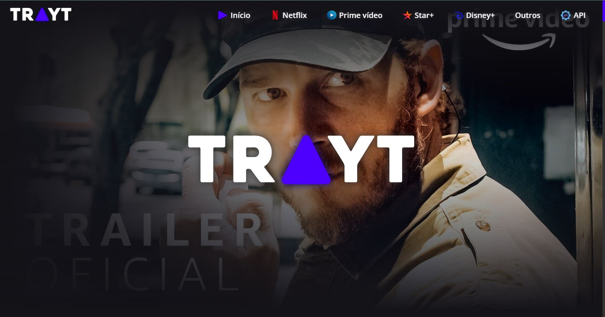
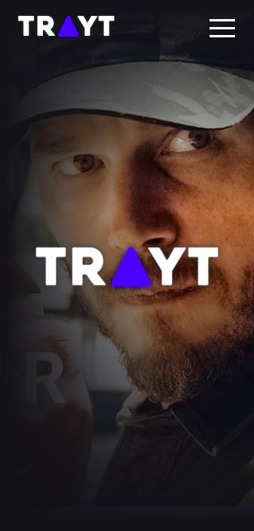

<div align="center">
  
</div>

---

<h1 align="center">🎬 Trayt</h1>
<h3 align="center">✔ STATUS: Concluído ✔</h3>

---

<h2 align="center">📖Sobre</h2>

<p align="left">Este projeto foi realizado para estudo de criação de API no Node.JS + o consumo no React. O back end com node é uma API que contém 155 items, sendo 101 somente de trailes/teasers oficiais. Os Trailers tem informações como id do item, nome do serviço de streaming, categoria do item, áudio(se é dublado ou legendado), descrição/sinopse, link da thumb do video, titulo e a url do vídeo(já pronta para colocar no "src" da tag iframe).

O front end com React consiste em mostra os trailers, por trás das câmeras, etc... que os serviços de streaming como Netflix, Prime vídeo, Star+ e Disney+ postam no YouTube. A página home/inicial mostra um background aleatório cada vez que atualiza a página, um campo de pesquisa mais específico e um opção para ordenar de forma crescente, decrescente ou padrão e em seguida a listagem de todos os vídeos. As páginas da Netflix, Prime vídeo, Star+ e Disney+ mostram seus respectivos vídeos e seus filtros, com opção de pôr trás das câmeras, trailers/teasers oficiais, outros e áudio. A página de outros é a mesma coisa só que com filtro de streaming. E por fim tem a página de API que detalha todas as rotas da API e com botão de ir até a URL da API de copiar a URL. Ele é 100% responsivo.</p>

---

<h2 align="center">✔O site contém:</h2>

✅ Material UI<br>
✅ Slider<br>
✅ Campo de busca<br>
✅ Filtro<br>
✅ Navbar<br>
✅ Modal<br>
✅ Consumo de API própria<br>
### etc...
---

<h2>Instalando</h2>

```
npm install
```
ou
```
npm i
```

<h2>E logo em seguida:</h2>

```
npm run dev
```

<p>O projeto vai ser iniciado em <a target="_blank" href='http://127.0.0.1:5173/'>http://127.0.0.1:5173/</p>

<h2 align="center">🖥Preview</h2>

</img>
<br>
<br>
<br>
</img>

### Veja o projeto em funcionamento <a target="_blank" href='https://trayt.netlify.app/'>aqui</a>. 🧐

---

<h2 align="center">🛠 Tecnologias</h2>

- [React](https://pt-br.reactjs.org/)
- [Material UI](https://mui.com/pt/)
- [HTML](https://html.com/)
- [CSS](https://developer.mozilla.org/pt-BR/docs/Web/CSS)
- [TypeScript](https://www.typescriptlang.org/)
- [Express](https://expressjs.com/pt-br/)
- [Node](https://nodejs.org/en/)
- [Vite](https://vitejs.dev/)

---

<h2 align="center">📝Licença</h2>

<p align="center">
   Este repositório está sob licença MIT. Você pode ver o arquivo <a href="https://github.com/gabriell-c/Monster-gym/blob/main/License"> LICENSE</a>
   para mais detalhes. 😉
</p>
